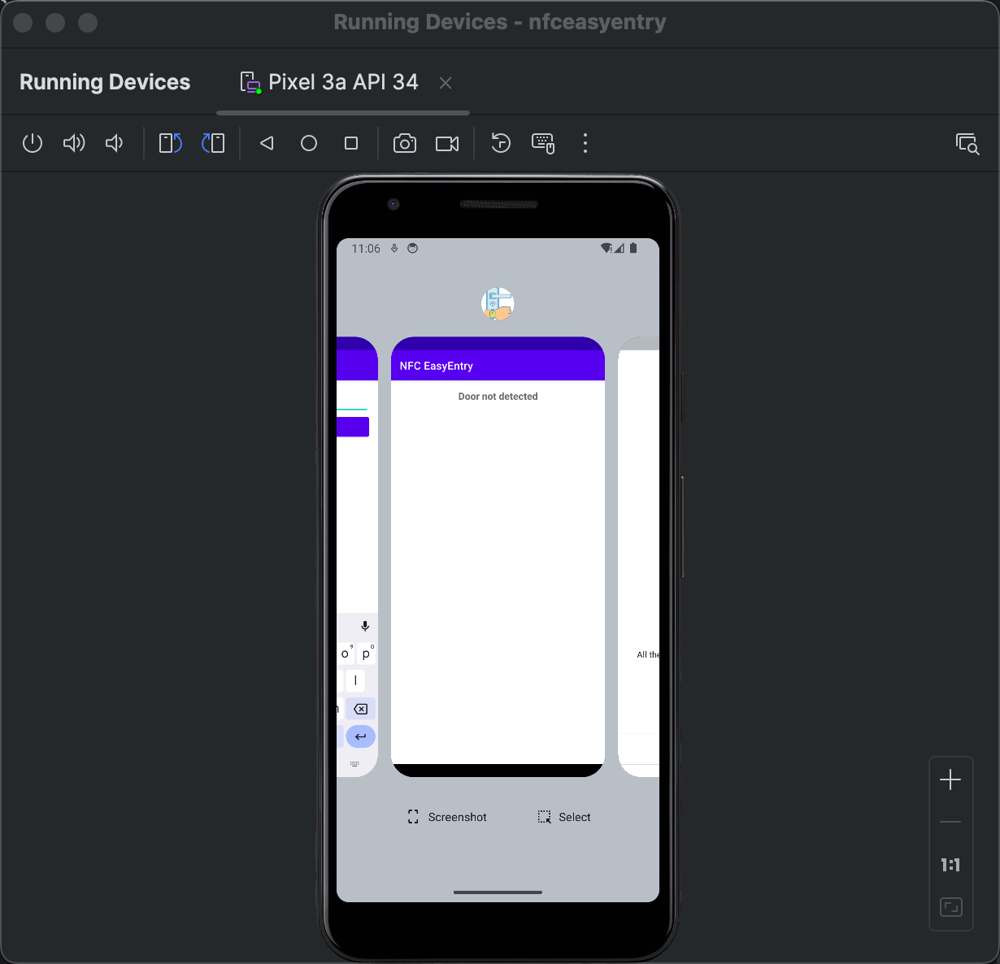
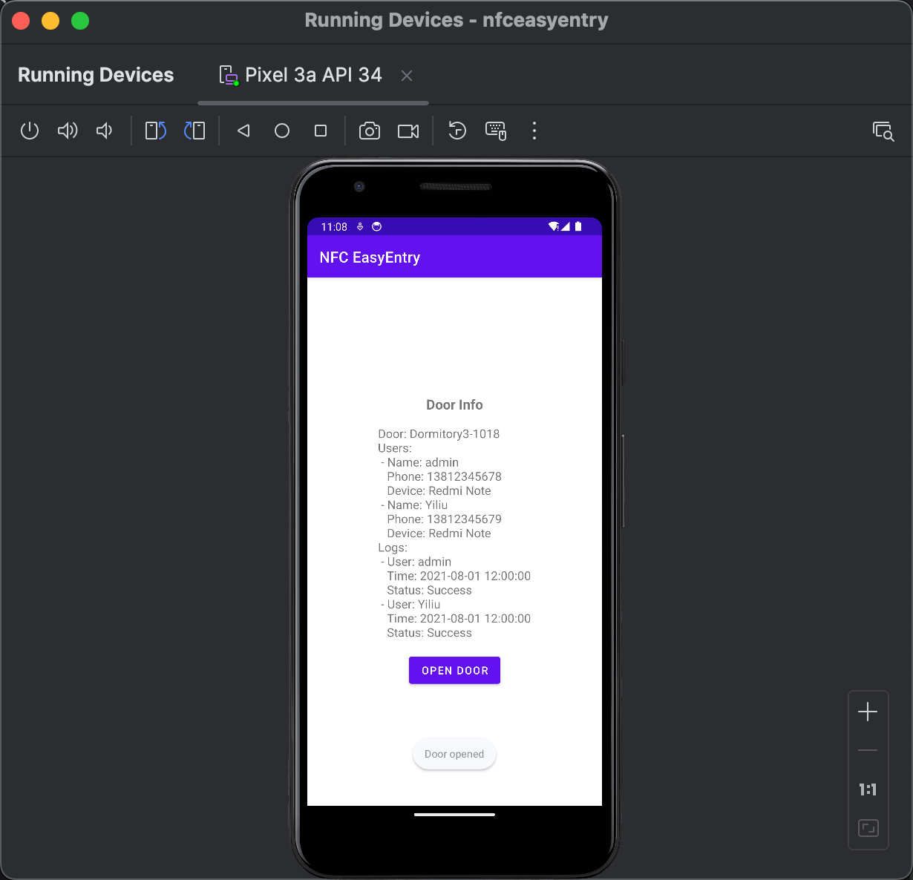

# NFC EasyEntry: NFC门禁系统移动应用

## 董奕柳 (2021210868) | 2021211304班

[Github链接](https://github.com/qianlihuang/NFC-EasyEntry)


---

## 系统概述

NFC EasyEntry 是一款利用 NFC 技术实现的门禁系统应用，通过管理员/用户的手机和门禁设备之间的直接通信完成门禁管理。



<style scoped>
  img {
    width: 450px;
    height: auto;
  }
</style>

---

## 背景与需求分析

- **钥匙开门**：传统钥匙开门方式存在钥匙容易丢失、被复制的问题。
- **刷卡开门**：刷卡开门方式存在卡片容易丢失、被盗刷的问题。
- **NFC EasyEntry 优势**：
  - 用户只需携带手机即可实现快速开门。
  - 消除了携带钥匙或刷卡的繁琐。

---

## 实现步骤

### 硬件准备

- 管理员/用户手机需要支持 NFC 功能。
- 在门上安装支持 NFC 通信的门禁设备。

### 系统开发

- **移动端应用**
  - **管理员端**：管理员使用该应用管理门禁系统，包括添加用户、删除用户、编辑用户信息、查看日志等。
  - **用户端**：普通用户使用该应用开启门锁。

---

## 手机APP界面

### 普通用户界面

- **开门按钮**：用户点击该按钮，门禁设备将识别用户手机并开启门锁，同时界面显示开门成功。
- **无法识别设备号快速开门**：当门禁设备无法识别用户手机时，提示用户输入密码。

### 管理员界面

- **查看和管理用户信息**：管理员可以查看和管理用户信息，包括用户姓名、手机号码等。
- **查看日志**：管理员可以查看用户的开门记录，了解用户的开门情况。

---


<style scoped>
  img {
    width: 300px;
    height: auto;
  }
</style>

---


<style scoped>
  img {
    width: 300px;
    height: auto;
  }
</style>

---




<style scoped>
  img {
    width: 800px;
    height: auto;
  }
</style>

---

## NFC设备中存储信息（JSON格式）

```json
{
  "door": "Dormitory3-1018",
  "users": [
    {
      "name": "admin",
      "phone": "13812345678",
      "device": "Redmi Note",
      "password": "123456",
    },
    {
      "name": "Yiliu",
      "phone": "13812345679",
      "device": "Redmi Note",
      "password": "123456",
    }
  ],
  "logs": [
    {
      "user": "admin",
      "time": "2021-08-01 12:00:00",
      "status": "Success"
    },
    {
      "user": "Yiliu",
      "time": "2021-08-01 12:00:00",
      "status": "Success"
    }
    {
      "user": "Zhikai",
      "time": "2021-08-01 12:00:00",
      "status": "Failed"
    }  
  ]
}
```

---

## 服务器/本机存储信息

```json
{
  "door": "Dormitory3-1018",
  "users": [
    {
      "name": "admin",
      "phone": "13812345678",
      "device": "Redmi Note",
      "password": "123456",
      "permission": "Dormitory3-1018",
      "time": "2021-08-01 12:00:00"
    }
  ]
}
```

---

## 系统优势

- **安全性**：通过 NFC 通信，提高了门禁系统的安全性，防止了传统钥匙的被复制和遗失问题。
- **便捷性**：用户只需携带手机即可开启门锁，无需携带钥匙，提高了用户的使用便捷性。

---

## 系统劣势

- **手机耗电**：使用 NFC 功能会消耗手机电量，需要注意手机电量的使用情况。

---

## 展望

- 可以采用可联网的NFC设备，数据存储在云端，实现远程控制和数据管理。
- 可扩展到智能手表、眼镜、各种可穿戴设备，实现更多的开门方式。

---

## Q&A

---

## 感谢

谢谢大家的聆听！