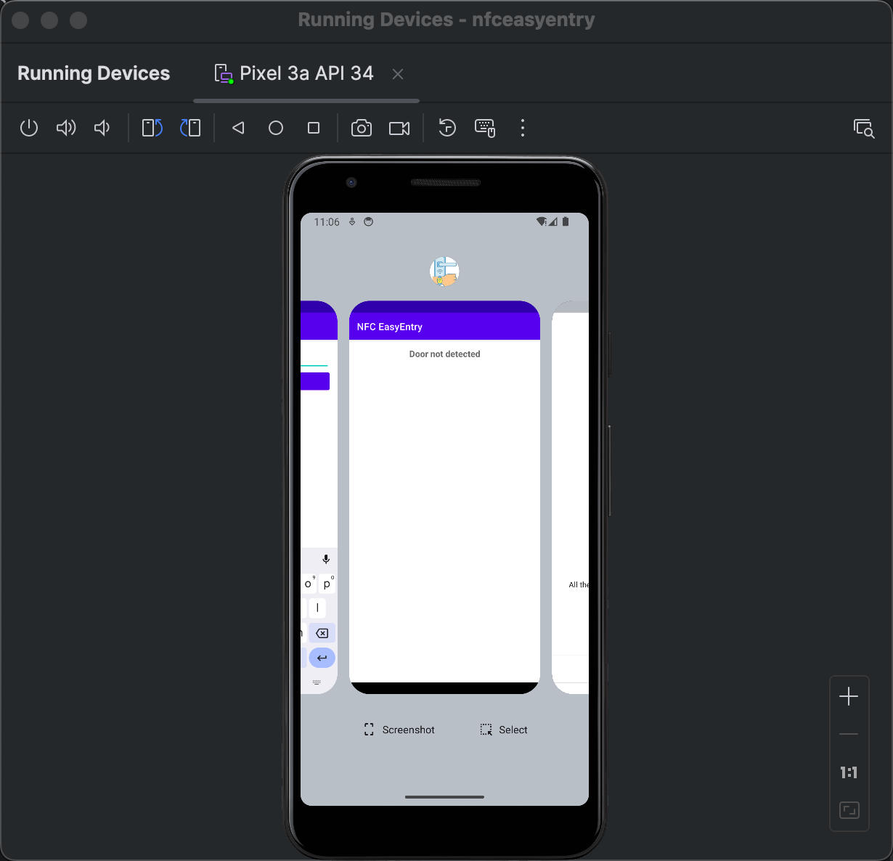
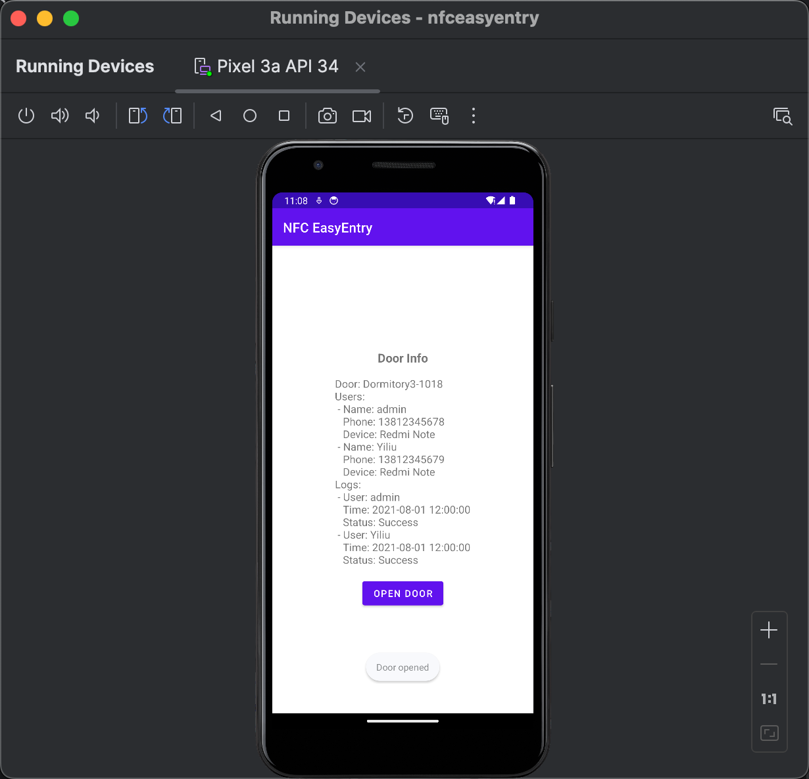

# NFC门禁系统

## 名称: NFC EasyEntry

### 系统概述

NFC EasyEntry 是一款利用 NFC 技术实现的门禁系统，通过管理员手机和门禁设备之间的直接通信完成门禁管理。系统的核心角色为管理员，使用手机进行门禁管理操作。

### 实现步骤

#### 硬件准备

- 管理员手机需要支持 NFC 功能。
- 在门上安装支持 NFC 通信的门禁设备。

#### 系统开发

- 移动端应用
  - 管理员端：管理员使用该应用管理门禁系统，包括添加用户、删除用户、编辑用户信息等操作。
  - 用户端：普通用户使用该应用开启门锁。

### 手机APP界面

（普通用户界面）

- 开门按钮：用户点击该按钮，门禁设备将识别用户手机并开启门锁，同时界面显示开门成功。
- 无法识别设备号快速开门：当门禁设备无法识别用户手机时，提示用户输入密码。

（管理员界面）

- 查看和管理用户信息：管理员可以查看和管理用户信息，包括用户姓名、手机号码等。
- 查看日志：管理员可以查看用户的开门记录，了解用户的开门情况。

一开始显示未检测到门，nfc检测到门后，显示门中的存储信息，并且提供一个开门按钮。





#### NFC设备中存储信息

##### json格式

```json
{
  "door": "Dormitory3-1018",
  "users": [
    {
      "name": "admin",
      "phone": "13812345678",
      "device": "Redmi Note",
      "password": "123456",
    },
    {
      "name": "Yiliu",
      "phone": "13812345679",
      "device": "Redmi Note",
      "password": "123456",
    }
  ],
  "logs": [
    {
      "user": "admin",
      "time": "2021-08-01 12:00:00",
      "status": "Success"
    },
    {
      "user": "Yiliu",
      "time": "2021-08-01 12:00:00",
      "status": "Success"
    }
  ]
}
```

#### 服务器/本机存储信息

```json
{
  "username": "admin",
  "phone": "13812345678",
  "device": "Redmi Note",
  "password": "123456",
  "permission": "Dormitory3-1018",
  "time": "2021-08-01 12:00:00"
}
```

### 系统优势

- 简化部署：无需复杂的门禁系统，仅需安装支持 NFC 通信的门禁设备即可实现门禁功能。
- 安全性：通过 NFC 通信，提高了门禁系统的安全性，防止了传统钥匙的被复制和遗失问题。

### 扩展

可以采用可联网的NFC设备，数据存储在云端，实现远程控制和数据管理。

扩展到智能手表应用
